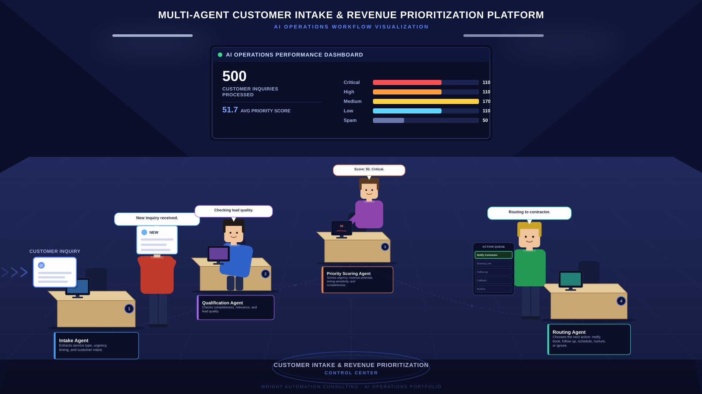
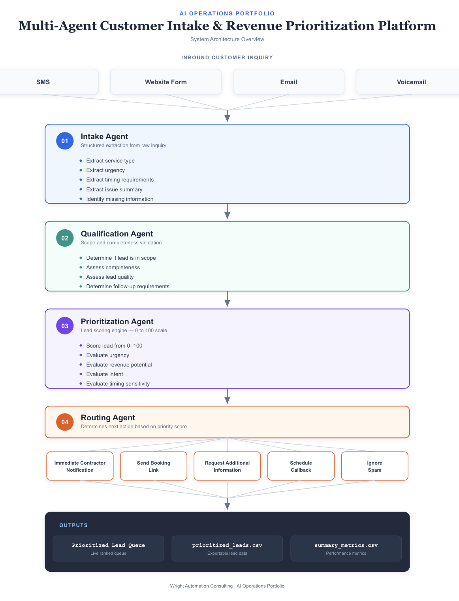

# Multi-Agent Customer Intake & Revenue Prioritization Platform



*Concept visualization of a multi-agent workflow where specialized AI agents collaborate to process, evaluate, prioritize, and route inbound customer inquiries.*

The image above represents the four specialized AI agents that process each customer inquiry:

1. Intake Agent — structures incoming requests
2. Qualification Agent — validates lead quality
3. Priority Scoring Agent — determines urgency and business impact
4. Routing Agent — recommends the next action

Each agent is responsible for a specific stage of the workflow and passes information to the next agent until a final routing decision is produced.

---

## Project Overview

This project started as an experiment to better understand how multiple AI agents could collaborate on a real business workflow instead of operating as isolated tools.

Most AI demos focus on a single model performing a single task. In practice, business processes involve multiple decisions, reviews, and handoffs before an outcome is reached.

To explore that concept, I built a simplified customer intake workflow where specialized agents work together to evaluate and prioritize inbound inquiries.

The result is a multi-agent system that processes incoming customer requests, determines their quality and urgency, assigns a priority score, and recommends the appropriate next action.

---

## Business Problem

Service businesses receive inquiries of varying quality and urgency.

Some requests represent immediate revenue opportunities.

Others require follow-up, additional information, or may not be a good fit at all.

Without a structured intake process, valuable opportunities can be delayed while low-value inquiries consume the same amount of attention.

This project explores how specialized AI agents can help create a more consistent and scalable decision-making process.

---

## Workflow

Customer Inquiry

↓

Intake Agent

↓

Qualification Agent

↓

Priority Scoring Agent

↓

Routing Agent

↓

Business Outcome

---

## Multi-Agent Architecture



### Intake Agent

Responsibilities:

* Extract service type
* Capture customer details
* Identify urgency signals
* Structure raw inquiry data

### Qualification Agent

Responsibilities:

* Validate inquiry completeness
* Determine lead quality
* Confirm business fit
* Flag missing information

### Priority Scoring Agent

Responsibilities:

* Assign numerical priority score
* Estimate business impact
* Evaluate urgency
* Categorize inquiry priority

### Routing Agent

Responsibilities:

* Determine recommended next action
* Route high-priority opportunities
* Generate follow-up recommendations
* Support operational decision making

---

## Example Output

The workflow generates a prioritized lead queue that operators can use to focus attention on the highest-impact opportunities first.


Each processed inquiry receives:

* Service Type
* Lead Quality
* Priority Score
* Priority Level
* Routing Recommendation

---

## Results

The final workflow processed 500 simulated inbound customer inquiries.


### Processing Summary

| Metric                    | Value |
| ------------------------- | ----- |
| Total Inquiries Processed | 500   |
| Critical Leads            | 110   |
| High Priority Leads       | 110   |
| Medium Priority Leads     | 170   |
| Low Priority Leads        | 110   |
| Spam / Out of Scope       | 50    |
| Average Priority Score    | 51.72 |

---

## Key Takeaways

Building this project reinforced several ideas:

* AI systems become more useful when responsibilities are clearly separated.
* Workflow design often matters more than model selection.
* Explainable decision logic is critical for business adoption.
* Multi-agent systems are fundamentally coordination problems.
* The most valuable AI implementations improve existing workflows rather than replace them.

---

## Repository Contents

```text
data/
│
├── inbound_customer_inquiries.csv

docs/
│
├── office-visualization.png
├── architecture-diagram.png
├── prioritized-lead-queue.png
├── lead-summary-metrics.png
├── implementation-notes.md

outputs/
│
├── prioritized_lead_queue.csv
├── lead_summary_metrics.csv

src/
│
├── intake_agent.py
├── qualification_agent.py
├── scoring_agent.py
├── routing_agent.py
├── run_pipeline.py

README.md
requirements.txt
```
